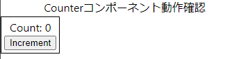

# 従来型Webページの一部としてReactを埋め込む方法

## はじめに
Reactのコンポーネントを従来型Webページの一部に組み込むことができないか？と思い調べてみましたが、意外にも具体的な手順が見つかりませんでした

そこで、下記3点に絞って手順をまとめました

1. Reactをコンポーネント単位で外部から利用できるようにビルドする手順
2. WebページにReactコンポーネントを表示する手順
3. Webページ側とReactコンポーネント間でやり取りを行う(初期値設定、相互の呼び出し)


### 概要

1. Reactコンポーネントを外部から利用できるような形でビルド(rollup.jsを利用)する
    * 従来型Webアプリではモジュール形式のJSを利用してないことが多いので、UMD形式（グローバル変数経由でReactコンポーネントを公開）でビルドします
    * 埋め込むコンポーネントはReactでおなじみの`Counter`コンポーネントをにご登場いただきます
1. ビルドしたjsファイルをHTMLページで読み込み、Reactコンポーネントを画面の部品として表示する
1. Webページ側とReactコンポーネント間でやり取りを行う
    * Reactコンポーネントへの初期値設定
    * Reactコンポーネント側のイベント処理から、Webページ側の処理を呼び出す
    * Webページ側のイベント処理から、React内部の処理を呼び出す


表示する`Counter`コンポーネント(初期値を引数で渡すことができるように変更済み)
```typescript
const Counter: FC<propType> = ({ initVal = 0 }) => {
  const [count, setCount] = useState(initVal);
  const handleClick = () => setCount((n) => n + 1);
  return (
    <Content>
      <div>Count: {count}</div>
      <button onClick={handleClick}>Increment</button>
    </Content>
  );
};
```


`Counter`コンポーネントを部品として表示するコード(のイメージ)

* `MyBundle`はコンポーネントを公開するためのグローバル変数(UMD形式でビルドする際に、変数名を指定する)
```html
  <body>
    <h2>Webページの一部にReactコンポーネントを表示する</h2>
    <div id="root"></div>
  </body>
  <script>
    const {ReactDOMClient, React, Counter} = MyBundle;
    const container = document.getElementById('root');
    const root = ReactDOMClient.createRoot(container);
    root.render(React.createElement(Counter));
  </script>
```

## `Counter`コンポーネントの準備

* create-react-appでReactのフォルダを作成する

```bash
npx create-react-app react-with-conventional-webapp --template typescript
cd react-with-conventional-webapp
```

* `styled-components`をインストール(コンポーネントの周りにborderを表示するだけのため)
```bash
$ npm i styled-components@5.3.10

$ npm i -D @types/styled-components
```

* 下記のエラーが出た場合は`npm i styled-components@5.3.10`でインストール可能 ([StackOverflowの解説](https://stackoverflow.com/questions/70810819/npm-err-cannot-read-properties-of-null-reading-edgesout/76219567#76219567))

```bash
  $ npm i styled-components
  npm ERR! Cannot read properties of null (reading 'edgesOut')
```


* `Counter`コンポーネント(ボタンを押すとカウントを加算)を追加

```bash
touch ./src/Counter.tsx
```

Counter.tsx
```tsx
import { FC, useState } from 'react';
import styled from 'styled-components';
const Content = styled.div`
  border: solid 1px black;
  width: fit-content;
  padding: 4px;
`;

type propType = {
  initVal?: number;
};
const Counter: FC<propType> = ({ initVal = 0 }) => {
  const [count, setCount] = useState(initVal);
  const handleClick = () => setCount((n) => n + 1);
  return (
    <Content>
      <div>Count: {count}</div>
      <button onClick={handleClick}>Increment</button>
    </Content>
  );
};
export default Counter;
```

* 動作確認

`App.tsx`ファイルを書き換えてから`npm run start`で実行する

```jsx
import './App.css';
import Counter from './Counter';

function App() {
  return (
    <div className="App">
      Counterコンポーネント動作確認
      <Counter initVal={0} />
    </div>
  );
}

export default App;
```

このような画面が表示されればOK




## Reactコンポーネントを外部から利用できるような形でビルド(rollup.jsを利用)する

ビルド用に
  * rollup.jsの導入
  * ビルド用スクリプト`rollup.config.js`の作成
  * rollup.jsでトランスパイルを行うための設定ファイル`tsconfig.rollup.json`を追加
  * `package.json`に設定(出力ファイル名)を追加
  * ビルドのエントリーポイントとなる`src/lib.ts`で、公開するコンポーネントをexportする
  * `package.json`の`scripts`にビルド用のコマンドを追加して動作確認

### [rollup.js](https://rollupjs.org/)の導入

ライブラリとしてパッケージングするため、[rollup.js](https://rollupjs.org/)を導入します。

* [rollup.js](https://rollupjs.org/)は複数のモジュールやファイルを1つのファイルにまとめてくれる、軽量で高速なバンドルツールです。

```bash
npm i -D rollup rollup-plugin-delete rollup-plugin-peer-deps-external rollup-plugin-typescript2 @rollup/plugin-commonjs @rollup/plugin-node-resolve @rollup/plugin-replace
```

### ビルド用スクリプト`rollup.config.js`の作成
続いて、ビルド用のスクリプトを作成します。rollup.config.jsをプロジェクトのルートに作成し、下記の内容を記載します
```javascript
import peerDepsExternal from 'rollup-plugin-peer-deps-external';
import resolve from '@rollup/plugin-node-resolve';
import commonjs from '@rollup/plugin-commonjs';
import replace from '@rollup/plugin-replace';
import typescript from 'rollup-plugin-typescript2';
import del from 'rollup-plugin-delete';
const packageJson = require('./package.json');

// eslint-disable-next-line import/no-anonymous-default-export
export default {
  input: 'src/lib.ts',
  output: [
    {
      // esmodule
      file: packageJson.module,
      format: 'esm',
      sourcemap: true,
    },
    { // UMD形式
      file: packageJson.umd,
      format: 'umd',
      name: 'MyBundle',
      sourcemap: true,
    },
  ],
  plugins: [
    del({ targets: 'dist/*' }),
    peerDepsExternal(),
    resolve(),
    commonjs(),
    replace({
      'process.env.NODE_ENV': JSON.stringify(process.env.NODE_ENV),
      preventAssignment: true,
    }),
    typescript({
      tsconfig: 'tsconfig.rollup.json',
      useTsconfigDeclarationDir: true,
    }),
  ],
};
```
* `input: 'src/lib.ts'`を起点にimportされているファイルを読み込み、バンドルします(1つのファイルにまとめる)。このファイルで、公開したいコンポーネントをexportします
* 出力は`ES Modules`形式、`UMD`形式に分けて2ファイル出力します
* `file:～`は出力するファイル名です。`package.json`に定義します（この後追加）

* rollup.jsで利用するプラグインについて
  * peerDepsExternal：`package.json`に記載されたpeerDependenciesパッケージをバンドル対象から除外して、バンドルサイズを削減する
  * resolve：他のモジュールをインポートにする際の依存関係の解決とファイルパスの特定を行う
  * commonjs：require()を解析してCommonJS形式の依存関係を特定する
  * replace：環境変数をビルド時に置換する。実行時にnodeの環境変数を参照する箇所がエラーとなるのを回避する
  * typescript：トランスパイルを行う。`tsconfig.rollup.json`を設定ファイルとして利用する。また、`useTsconfigDeclarationDir: true`を指定することで、型定義ファイル(d.ts)をtsconfigファイルの`declarationDir`に出力する

### rollup.jsでトランスパイルを行うための設定ファイル`tsconfig.rollup.json`を追加

rollup.js用トランスパイル設定ファイル`tsconfig.rollup.json`をプロジェクトルートに作成します

```json
{
  "extends": "./tsconfig",
  "compilerOptions": {
    "outDir": "dist",
    "declaration": true,
    "declarationDir": "dist",
  },
  "exclude": [
    "node_modules",
    "dist",
    "build",
  ]
}
```

* `"extends": "./tsconfig",`

  create-react-appで作成された`tsconfig.json`の設定を継承します

* `"outDir": "dist",`

  出力先を`dist`にします

* `"declaration": true,`、` "declarationDir": "dist"`

  型定義ファイルの出力を有効にして、出力先を`dist`にします


### `package.json`に設定(出力ファイル名)を追加

rollup.jsで出力するファイル名の設定を追加します（ESModule用と、UMD用の2つ）

```diff_json
{
  "name": "react-with-conventional-webapp",
  "version": "0.1.0",
  "private": true,
+  "module": "dist/lib.esm.js",
+  "umd": "dist/lib.umd.js",
```


### ビルドのエントリーポイントとなる`src/lib.ts`で、公開するコンポーネントをexportする

パッケージに公開するコンポーネント(関数)をexportします

`Counter`だけではなく、`React`関連もexportして一緒にパッケージングします（別途読み込み不要になる)

```typescript
export { default as React } from 'react';
export { default as ReactDOM } from 'react-dom';
export { default as ReactDOMClient } from 'react-dom/client';
// Component
export { default as Counter } from './Counter';
```

### `package.json`の`scripts`にビルド用のコマンドを追加して動作確認

`package.json`の`scripts`に、パッケージビルド用のコマンドを追記します


```json
  "scripts": {
+    "build-lib": "rollup -c"
  },
```

ビルドでエラーが発生しないことを確認します
* `dist/lib.esm.js, dist/lib.umd.js` の2ファイルが作成されます

```bash
$ npm run build-lib

> react-with-conventional-webapp@0.1.0 build-lib
> rollup -c


src/lib.ts → dist/lib.esm.js, dist/lib.umd.js...
created dist/lib.esm.js, dist/lib.umd.js in 4.1s
```

## ReactコンポーネントをHTMLページの一部として埋め込む


## 参考ページ

* [既存のページに部分的にReactを導入する](https://minno.site/2021/02/13/%E6%97%A2%E5%AD%98%E3%81%AE%E3%83%9A%E3%83%BC%E3%82%B8%E3%81%AB%E9%83%A8%E5%88%86%E7%9A%84%E3%81%ABreact%E3%82%92%E5%B0%8E%E5%85%A5%E3%81%99%E3%82%8B/)
* [React部分導入時の開発・検証環境紹介](https://note.com/tabelog_frontend/n/n8d6734ddee33)
* [非SPAなサービスにReactを導入する](https://techlife.cookpad.com/entry/2016/10/26/135818)
* [Reactを部分導入する場合にReact root外の要素と連携する](https://launchcart.jp/blog/react%E3%82%92%E9%83%A8%E5%88%86%E5%B0%8E%E5%85%A5%E3%81%99%E3%82%8B%E5%A0%B4%E5%90%88%E3%81%ABreact-root%E5%A4%96%E3%81%AE%E8%A6%81%E7%B4%A0%E3%81%A8%E9%80%A3%E6%90%BA%E3%81%99%E3%82%8B/)
