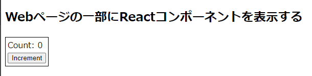
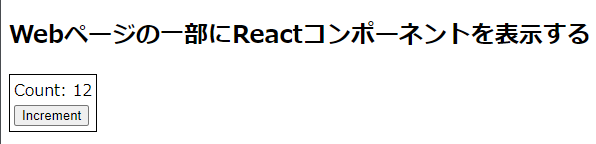
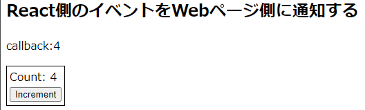
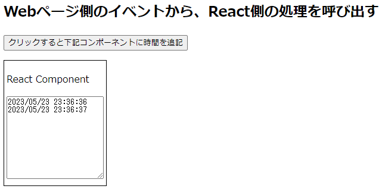

# 従来型Webページの一部としてReactを埋め込む方法

## はじめに
Reactのコンポーネントを従来型Webページの一部に組み込むにはどうすればいいのか？と思い調べてみましたが、意外にも具体的な手順が見つかりませんでした

そこで、コンポーネントのビルド、ページ内の部品として表示、コンポーネント外部とのやり取りの3点に絞って手順をまとめてみました

1. Reactコンポーネントを外部から利用できるようにビルドする手順
2. ReactのコンポーネントをWebページの一部として表示する手順
3. Webページ側とReactコンポーネント間でやり取りを行う(初期値設定、相互の呼び出し)


### 概要

create-react-appを使ってひな形を生成し、おなじみ`Counter`コンポーネントを作ってから、外部で利用できるようにしていきます

1. Reactコンポーネントを外部から利用できるようにビルド([rollup.js](https://rollupjs.org/)を利用)する
    * 従来型Webアプリではモジュール形式のJSを利用してないことが多いので、UMD形式（グローバル変数経由でReactコンポーネントを公開）でビルドする
    * 埋め込むコンポーネントはReactでおなじみの`Counter`コンポーネントを利用
1. ReactのコンポーネントをWebページの一部として表示する
1. Webページ側とReactコンポーネント間でやり取りを行う
    * Reactコンポーネントへの初期値設定
    * Reactコンポーネント側のイベント処理から、Webページ側の処理を呼び出す
    * Webページ側のイベント処理から、React内部の処理を呼び出す


`Counter`コンポーネントを部品として表示するコード(のイメージ)

* `MyBundle`はコンポーネントを公開するためのグローバル変数(UMD形式でビルドする際に、指定した変数名)
* `ReactDOMClient.createRoot()`で`root`を作成し、コンポーネントをrenderします
```html
  <body>
    <h2>Webページの一部にReactコンポーネントを表示する</h2>
    <div id="root"></div>
  </body>
  <script src="/dist/lib.umd.js"></script>
  <script>
    const {ReactDOMClient, React, Counter} = MyBundle;
    const container = document.getElementById('root');
    const root = ReactDOMClient.createRoot(container);
    root.render(React.createElement(Counter));
  </script>
```

ESModule形式でビルドした場合はこのようになります

```html
  <script type="module">
    import {ReactDOMClient, React, Counter} from '/dist/lib.esm.js';
    const container = document.getElementById('root');
    const root = ReactDOMClient.createRoot(container);
    root.render(React.createElement(Counter));
  </script>
```

## 準備：`Counter`コンポーネントを作成

* create-react-appでReactのひな形を作成

```bash
$ npx create-react-app react-with-conventional-webapp --template typescript
$ cd react-with-conventional-webapp
```

* `styled-components`をインストール(Reactコンポーネントを目立だたせるため、borderを表示する)
```bash
$ npm i styled-components@5.3.10

$ npm i -D @types/styled-components
```

* 下記のエラーが出た場合は`npm i styled-components@5.3.10`でインストール可能 ([StackOverflowの解説](https://stackoverflow.com/questions/70810819/npm-err-cannot-read-properties-of-null-reading-edgesout/76219567#76219567))

```bash
  $ npm i styled-components
  npm ERR! Cannot read properties of null (reading 'edgesOut')
```


* `Counter`コンポーネント(ボタンを押すとカウントを加算)を追加

```bash
$ touch ./src/Counter.tsx
```

Counter.tsx
```tsx
import { FC, useState } from 'react';
import styled from 'styled-components';
const Content = styled.div`
  border: solid 1px black;
  width: fit-content;
  padding: 4px;
`;

type propType = {
  initVal?: number;
};
const Counter: FC<propType> = ({ initVal = 0 }) => {
  const [count, setCount] = useState(initVal);
  const handleClick = () => setCount((n) => n + 1);
  return (
    <Content>
      <div>Count: {count}</div>
      <button onClick={handleClick}>Increment</button>
    </Content>
  );
};
export default Counter;
```

動作確認

* `App.tsx`ファイルを書き換えてから`npm run start`で実行する

```jsx
import './App.css';
import Counter from './Counter';

function App() {
  return (
    <div className="App">
      Counterコンポーネント動作確認
      <Counter initVal={0} />
    </div>
  );
}

export default App;
```

このような画面が表示されればOK


## ①Reactコンポーネントを外部から利用できるようにビルド([rollup.js](https://rollupjs.org/)を利用)する

ビルドを行うための手順
  * [rollup.js](https://rollupjs.org/)の導入
  * ビルド用スクリプト`rollup.config.js`を作成
  * [rollup.js](https://rollupjs.org/)でトランスパイルを行うため、`tsconfig.rollup.json`を追加
  * `package.json`に出力ファイル名を追加(`rollup.config.js`で利用)
  * 公開するコンポーネントをエントリーポイントファイル(`src/lib.ts`)でexportする
  * `package.json`の`scripts`にビルド用のコマンド`build-lib`を追加して動作確認を行う

### [rollup.js](https://rollupjs.org/)の導入

ライブラリとしてパッケージングするため、[rollup.js](https://rollupjs.org/)と必要なプラグインを導入します

* [rollup.js](https://rollupjs.org/)は複数のモジュールやファイルを1つのファイルにまとめてくれる、軽量で高速なバンドルツールです

```bash
npm i -D rollup rollup-plugin-delete rollup-plugin-peer-deps-external rollup-plugin-typescript2 @rollup/plugin-commonjs @rollup/plugin-node-resolve @rollup/plugin-replace
```

### ビルド用スクリプト`rollup.config.js`の作成
続いて、ビルド用のスクリプトを作成します。`rollup.config.js`をプロジェクトのルートに作成し、下記の内容を記載します
```javascript
import peerDepsExternal from 'rollup-plugin-peer-deps-external';
import resolve from '@rollup/plugin-node-resolve';
import commonjs from '@rollup/plugin-commonjs';
import replace from '@rollup/plugin-replace';
import typescript from 'rollup-plugin-typescript2';
import del from 'rollup-plugin-delete';
const packageJson = require('./package.json');

// eslint-disable-next-line import/no-anonymous-default-export
export default {
  input: 'src/lib.ts',
  output: [
    {
      // esmodule
      file: packageJson.module,
      format: 'esm',
      sourcemap: true,
    },
    { // UMD形式
      file: packageJson.umd,
      format: 'umd',
      name: 'MyBundle',
      sourcemap: true,
    },
  ],
  plugins: [
    del({ targets: 'dist/*' }),
    peerDepsExternal(),
    resolve(),
    commonjs(),
    replace({
      'process.env.NODE_ENV': JSON.stringify(process.env.NODE_ENV),
      preventAssignment: true,
    }),
    typescript({
      tsconfig: 'tsconfig.rollup.json',
      useTsconfigDeclarationDir: true,
    }),
  ],
};
```
* `input: 'src/lib.ts'`を起点にimportされているファイルを読み込み、バンドルします(1つのファイルにまとめる)。公開したいコンポーネントをexportするファイルです
* `ES Modules`形式、`UMD`形式に分けて2種類のファイル出力します
* `file:～`は出力するファイル名です。`package.json`で定義した値を利用します（この後追加）

#### rollup.jsで利用するプラグインについて
  * peerDepsExternal

    `package.json`に記載されたpeerDependenciesパッケージをバンドル対象から除外して、バンドルサイズを削減する
  * resolve

    インポートするモジュールの依存関係の解決とファイルパスの特定を行う

  * commonjs

    require()を解析してCommonJS形式の依存関係を特定する

  * replace

    ビルド時に置換処理を行う。実行時にnodeの環境変数を参照する箇所がエラーとなるため、ビルド時に置換する

  * typescript

    トランスパイルを行う。設定ファイルは`tsconfig.rollup.json`を利用する。また型定義ファイル(d.ts)を出力するため、`useTsconfigDeclarationDir: true`を指定する。出力先はtsconfigファイルの`declarationDir`

### [rollup.js](https://rollupjs.org/)でトランスパイルを行うため、`tsconfig.rollup.json`を追加

rollup.js用トランスパイル設定ファイル`tsconfig.rollup.json`をプロジェクトルートに作成します

```json
{
  "extends": "./tsconfig",
  "compilerOptions": {
    "outDir": "dist",
    "declaration": true,
    "declarationDir": "dist",
  },
  "exclude": [
    "node_modules",
    "dist",
    "build",
  ]
}
```

* `"extends": "./tsconfig",`

  create-react-appで作成された`tsconfig.json`の設定を継承します

* `"outDir": "dist",`

  出力先の指定

* `"declaration": true,`、` "declarationDir": "dist"`

  型定義ファイルの出力を有効にして、出力先を`dist`にします


### `package.json`に出力ファイル名を追加(`rollup.config.js`で利用)

rollup.jsで出力するファイル名の設定を追加します（ESModule用と、UMD用の2つ）

```diff_json
{
  "name": "react-with-conventional-webapp",
  "version": "0.1.0",
  "private": true,
+  "module": "dist/lib.esm.js",
+  "umd": "dist/lib.umd.js",
```


### 公開するコンポーネントをエントリーポイントファイル(`src/lib.ts`)でexportする

公開するコンポーネント(関数)をexportします

`Counter`だけではなく、`React`自体も一緒にexportしてパッケージングします（別途読み込み不要になる）

```typescript
export { default as React } from 'react';
export { default as ReactDOM } from 'react-dom';
export { default as ReactDOMClient } from 'react-dom/client';
// Component
export { default as Counter } from './Counter';
```

### `package.json`の`scripts`にビルド用のコマンドを追加して動作確認

パッケージビルド用のコマンドを追記します


```json
  "scripts": {
+    "build-lib": "rollup -c"
  },
```

ビルドエラーが発生しないことを確認します
* エラーがなければ`dist/lib.esm.js, dist/lib.umd.js` の2ファイルが作成されます

```bash
$ npm run build-lib

> react-with-conventional-webapp@0.1.0 build-lib
> rollup -c


src/lib.ts → dist/lib.esm.js, dist/lib.umd.js...
created dist/lib.esm.js, dist/lib.umd.js in 4.1s
```

## ②ReactのコンポーネントをWebページの一部として表示する

動作確認のためhtmlファイルを作成します。`webroot`フォルダをルート直下に作成しその中に保存していきます

```bash
$ mkdir webroot
$ touch webroot/test1.html
```

`test1.html`に下記内容を書き込みます

* `<div id="root"></div>`の部分に、Reactコンポーネント(`Counter`)を描画

```html
<!DOCTYPE html>
<html>
  <body>
    <h2>Webページの一部にReactコンポーネントを表示する</h2>
    <div id="root"></div>
  </body>
  <script src="/dist/lib.umd.js"></script>
  <script>
    const {ReactDOMClient, React, Counter} = MyBundle;
    const container = document.getElementById('root');
    const root = ReactDOMClient.createRoot(container);
    root.render(React.createElement(Counter));
  </script>
</html>
```


動作確認のためにWebサーバーを起動します

```bash
$ npx http-server .
```
`http://localhost:8080/webroot/test1.html`を開きます。htmlの一部としてReactコンポーネントが表示されることを確認します




* ESModule形式(lib.esm.js)を利用する場合は以下の記述になります

test1_esm.html
```html
<!DOCTYPE html>
<html>
  <body>
    <h2>Webページの一部にReactコンポーネントを表示する</h2>
    <div id="root"></div>
  </body>
  <script type="module">
    import {ReactDOMClient, React, Counter} from '/dist/lib.esm.js';
    const container = document.getElementById('root');
    const root = ReactDOMClient.createRoot(container);
    root.render(React.createElement(Counter));
  </script>
</html>
```


## ③Webページ側とReactコンポーネント間でやり取りを行う

### Reactコンポーネントへの初期値設定

Counterコンポーネントは引数(属性)で初期値をセットできるようになっています

```typescript
type propType = {
  initVal?: number;
};
const Counter: FC<propType> = ({ initVal = 0 }) => {
```

`React.createElement()`の引数に、`initVal`を追加することで初期値を設定することができます

* PHPなどサーバ側から初期値をセットして表示することが可能です

test2.html
```html
<!DOCTYPE html>
<html>
  <body>
    <h2>Webページの一部にReactコンポーネントを表示する</h2>
    <div id="root"></div>
  </body>
  <script type="module">
    import {ReactDOMClient, React, Counter} from '/dist/lib.esm.js';
    const container = document.getElementById('root');
    const root = ReactDOMClient.createRoot(container);
    root.render(React.createElement(Counter,{initVal:12}));
  </script>
</html>
```



### Reactコンポーネント側のイベント処理から、Webページ側の処理を呼び出す


propsにcallback関数を追加して、React側から呼び出します（countを渡す）


CallbackCounter.tsx
```typescript
import { FC, useState } from 'react';
import styled from 'styled-components';
const Content = styled.div`
  border: solid 1px black;
  width: fit-content;
  padding: 4px;
`;

type propType = {
  initVal?: number;
  callback: (num: number) => number;
};
const CallbackCounter: FC<propType> = ({ initVal = 0, callback }) => {
  const [count, setCount] = useState(initVal);
  const handleClick = () => {
    setCount((n) => n + 1);
    if (callback) {
      callback(count + 1);
    }
  };
  return (
    <Content>
      <div>Count: {count}</div>
      <button onClick={handleClick}>Increment</button>
    </Content>
  );
};
export default CallbackCounter;
```

CallbackCounterをexportします

lib.ts
```typescript
export { default as React } from 'react';
export { default as ReactDOM } from 'react-dom';
export { default as ReactDOMClient } from 'react-dom/client';
// Component
export { default as Counter } from './Counter';
+ export { default as CallbackCounter } from './CallbackCounter';
```

html側でコンポーネントに`callback関数`を渡します。callback関数は、引数経由で受け取ったcountの値を表示します


test3.html
```html
<!DOCTYPE html>
<html>
  <body>
    <h2>React側のイベントをWebページ側に通知する</h2>
    <p>
      callback:<span id="callback">
    </p>
    <div id="root"></div>
  </body>
  <script src="/dist/lib.umd.js"></script>
  <script>
    const {ReactDOMClient, React, CallbackCounter} = MyBundle;
    const $ = (selectors) => document.querySelector(selectors);
    const root = ReactDOMClient.createRoot($('#root'));
    root.render(
      React.createElement(CallbackCounter,{
        callback: (val)=> $('#callback').innerText = `${val}`}
      )
    );
  </script>
</html>

  ```

ボタンをクリックすると、callback関数が呼び出されて`callback:`の後ろのカウントが更新されます



### Webページ側のイベント処理から、React内部の処理を呼び出す

Webページ側から、Reactの処理を呼び出すために[カスタムイベント](https://developer.mozilla.org/ja/docs/Web/Events/Creating_and_triggering_events)を利用します


#### 1：カスタムイベントを受信するコンポーネントを作成します

* `ButtonClick`という名前のカスタムイベントを受信する
* イベントのデータ(日時)を受け取り、yyyyMMdd HHmmss形式にフォーマットして表示する

EventReceiver.tsx
```typescript
import { useState, useEffect } from 'react';
import styled from 'styled-components';

// カスタムイベントの型設定
declare global {
  interface DocumentEventMap {
    ButtonClick: CustomEvent<Date>;
  }
}

const Content = styled.div`
  border: solid 1px black;
  width: fit-content;
  padding: 4px;
`;

const formatDate = (date: Date) => {
  return new Intl.DateTimeFormat('ja-jp', {
    year: 'numeric',
    month: '2-digit',
    day: '2-digit',
    hour: '2-digit',
    minute: '2-digit',
    second: '2-digit',
  }).format(date);
};

const EventReceiver = () => {
  const [log, setLog] = useState('');
  useEffect(() => {
    document.addEventListener('ButtonClick', appendEventLog);
    return () => {
      document.removeEventListener('ButtonClick', appendEventLog);
    };
  }, []);

  function appendEventLog(data: CustomEvent<Date>) {
    setLog((value) => value + formatDate(data.detail) + '\r\n');
  }

  return (
    <Content>
      <p>React Component</p>
      <textarea value={log} style={{ height: '10em' }}></textarea>
    </Content>
  );
};
export default EventReceiver;
```

EventReceiverをexportします

lib.ts
```typescript
export { default as React } from 'react';
export { default as ReactDOM } from 'react-dom';
export { default as ReactDOMClient } from 'react-dom/client';
// Component
export { default as Counter } from './Counter';
export { default as CallbackCounter } from './CallbackCounter';
export { default as EventReceiver } from './EventReceiver';
```

#### 2：Webページ側からカスタムイベントを配信する

ボタンのクリック時に、イベントを発生させて現在時刻を渡します

test4.html
```html
<!DOCTYPE html>
<html>
  <body>
    <h2>Webページ側のイベントから、React側の処理を呼び出す</h2>
    <p>
      callback:<span id="callback">
    </p>
    <div id="root"></div>
  </body>
  <script src="/dist/lib.umd.js"></script>
  <script>
    const {ReactDOMClient, React, EventReceiver} = MyBundle;
    const $ = (selectors) => document.querySelector(selectors);
    $('#outerButton').addEventListener('click', () => {
        // イベントを配信
        const event = new CustomEvent('ButtonClick', {detail: new Date()});
        document.dispatchEvent(event);
    });

    const root = ReactDOMClient.createRoot($('#root'));
    root.render(
      React.createElement(EventReceiver)
    );
  </script>
</html>
```

ボタンをクリックすると、カスタムイベント経由でReactに通知できました




## 参考ページ

* [既存のページに部分的にReactを導入する](https://minno.site/2021/02/13/%E6%97%A2%E5%AD%98%E3%81%AE%E3%83%9A%E3%83%BC%E3%82%B8%E3%81%AB%E9%83%A8%E5%88%86%E7%9A%84%E3%81%ABreact%E3%82%92%E5%B0%8E%E5%85%A5%E3%81%99%E3%82%8B/)
* [React部分導入時の開発・検証環境紹介](https://note.com/tabelog_frontend/n/n8d6734ddee33)
* [非SPAなサービスにReactを導入する](https://techlife.cookpad.com/entry/2016/10/26/135818)
* [Reactを部分導入する場合にReact root外の要素と連携する](https://launchcart.jp/blog/react%E3%82%92%E9%83%A8%E5%88%86%E5%B0%8E%E5%85%A5%E3%81%99%E3%82%8B%E5%A0%B4%E5%90%88%E3%81%ABreact-root%E5%A4%96%E3%81%AE%E8%A6%81%E7%B4%A0%E3%81%A8%E9%80%A3%E6%90%BA%E3%81%99%E3%82%8B/)
